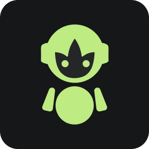
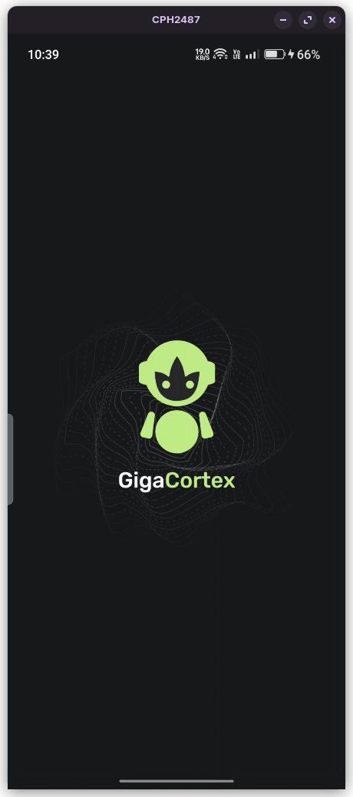
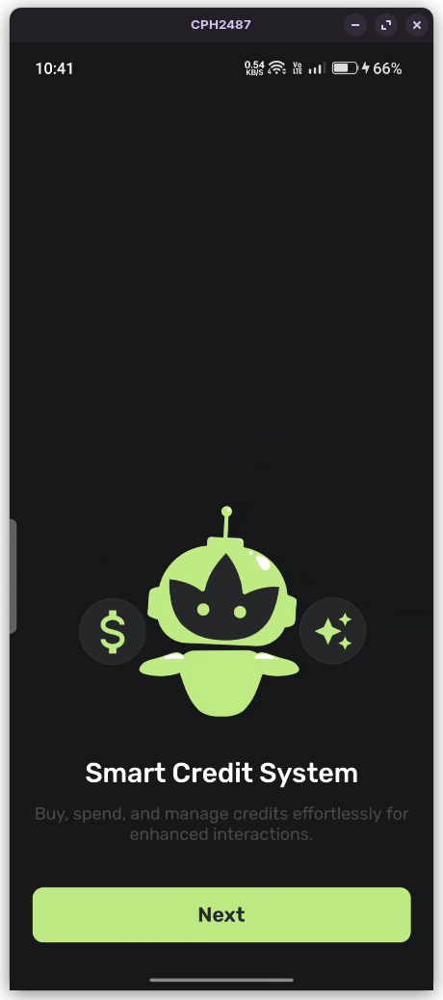
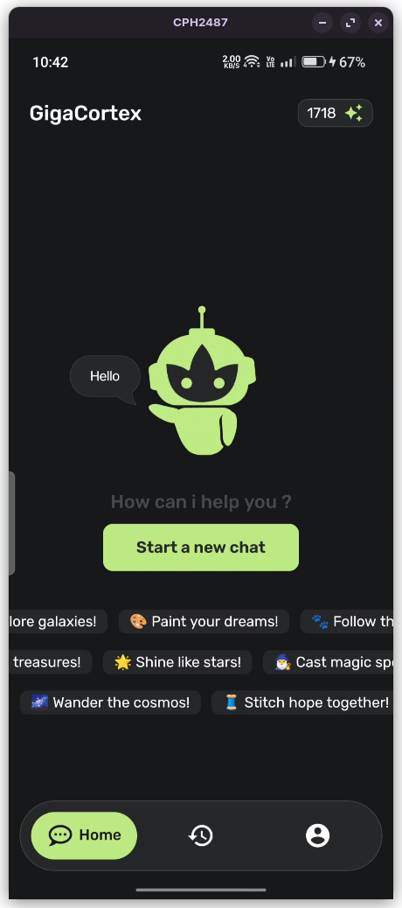
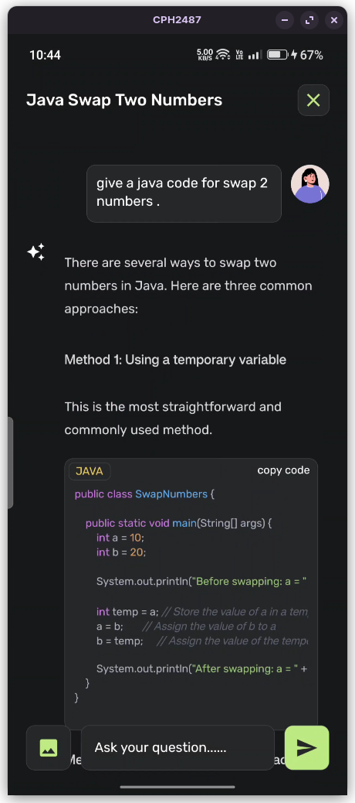
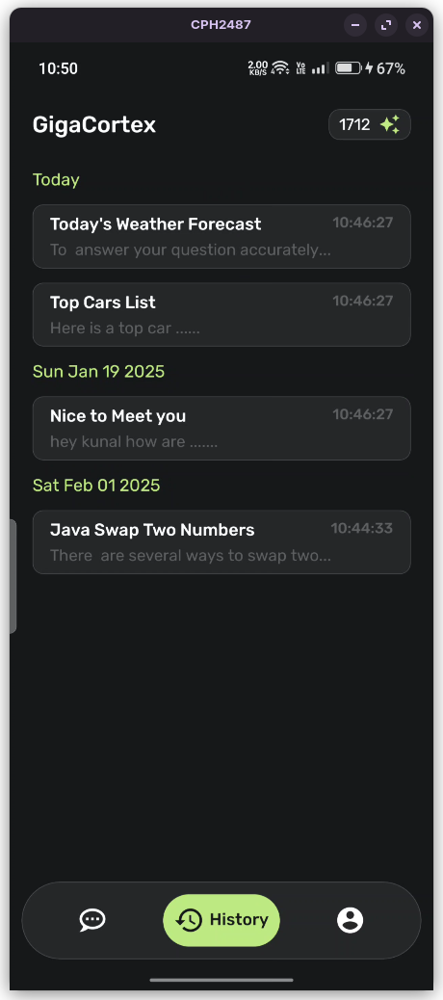
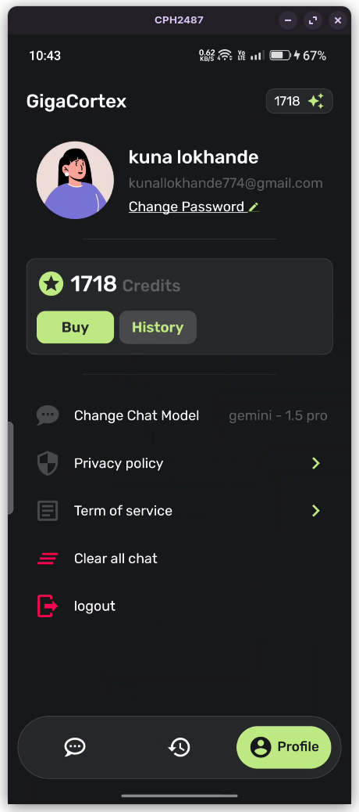
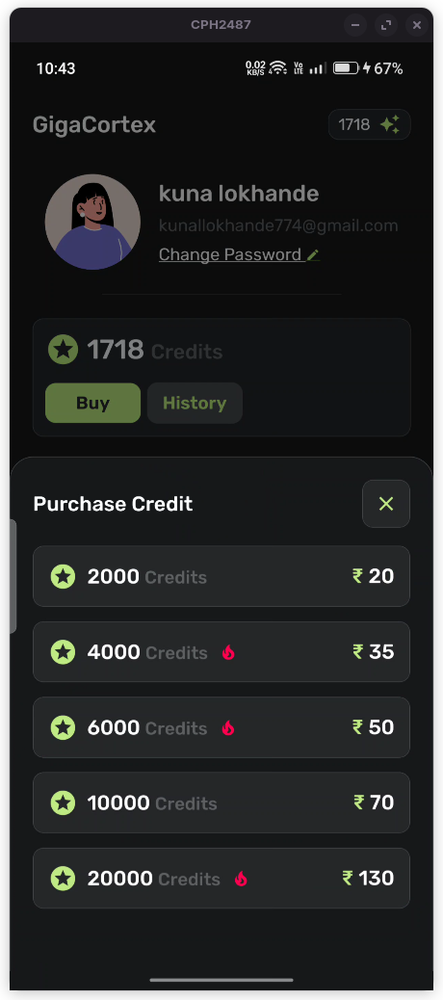

# Gigacortex 

AI Chat **Android / IOS** App

## Demo APK

Demo Apk file : [Download](https://github.com/LinuxKunaL/GigaCortex-ai-chat-app/raw/refs/heads/main/download/GigaCortex.apk)

## Overview

A full-stack application built with **React Native** (frontend) and **Node.js** (backend), integrating **Ollama model**, **Gemini API**, **MongoDB**, **authentication**, and **Socket.io** for real-time communication and **credit system** or **payment getaway**.

## Features

- **React Native** for the mobile frontend.
- **Redux Toolkit** for State Management in frontend.
- **Node.js & Express** for the backend.
- **MongoDB** for database storage.
- **Ollama Local Model** integration on-server AI services.
- **Gemini API** integration for cloud-based AI services.
- **JWT Authentication** for secure access control.
- **Socket.io** for real-time messaging and updates.
- **Razorpay** for payments to purchase the credit.

---

## Tech Stack

- **Frontend:** React Native (Expo/CLI)
- **Backend:** Node.js, Express.js
- **Database:** MongoDB (Mongoose ODM)
- **AI Models:** Ollama Model, Gemini API
- **Authentication:** JSON Web Token (JWT)
- **Real-Time Communication:** Socket.io

---

## Screenshots
<div style="display:flex;flex-wrap:wrap">







</div>

---

## Installation

### Prerequisites

Ensure you have the following installed:

- **Node.js** & **npm**
- **MongoDB**
- **React Native CLI** (or Expo if using Expo)
- **ollama** [Setup](#ollama-local-setup)

### App and server Setup

1. Clone the repository:
   ```sh
   git clone https://github.com/LinuxKunaL/GigaCortex-ai-chat-app
   cd GigaCortex-ai-chat-app
   ```
2. Install dependencies for server / app in same time :
   ```sh
   npm install:all
   ```
3. Configure environment variables for app / server:

   1. **server** environment variables in `server/.env`:

   ```ini
    PORT= 3000
    MONGODB_URL= mongodb://localhost:27017/gigacortex
    JWT_SECRET= your-secret-key
    GEMINI_KEY= your-gemini-api-key
    RAZORPAY_KEY_ID= your-razorpay-key-id
    RAZORPAY_KEY_SECRET= your-razorpay-key-secret
   ```

   2. **app** environment variables in `app/.env`:

   ```ini
    API_URL= your-backend-url
    RAZORPAY_KEY_ID= your-razorpay-key-id
   ```

4. Start the _App_ and _Server_:

   1. Start the **app**:

   ```sh
   npm run start:app
   ```

   2. Start the **server**:

   ```sh
   npm run start:server
   ```

5. **build** the _App_:
   ```sh
   npm run build:install
   ```

### ollama local setup
Note : ollama local AI needs a **high specification** of laptop / PC to run **smooth** and **faster** without any lag
1. install ollama:

   1. Linux :

   ```sh
   curl -fsSL https://ollama.com/install.sh | sh
   ```

   2. MacOS : [Open Ollama website](https://ollama.com/download/mac)
   3. Windows: [Open Ollama website](https://ollama.com/download/windows)

2. install model ( llama3 ) :

   ```sh
   ollama run llama3.1:8b
   ```

   If you want to install other models then visit : [Ollama models](https://ollama.com/search)

3. setup **config** file `server/config/index.js` :

   ```javascript

       const config = {
       ...
       ollamaModels: {
           llama3: "", // place the model name that was installed on your machine
       },
    };
   ```

4. You can **switch** the model in `server/controller/chat.socket.js` :

   ```javascript
        ...
       const streamResponse = await Ollama.chat({
        model: config.ollamaModels.llama3, // you can switch the models
        ...
      });
      ...
   ```

---

## Contributing

1. Fork the repository.
2. Commit your changes.
3. Push to your fork.
4. Submit a pull request.

---

## License

MIT License

---

## Contact

For inquiries or contributions, contact [kunallokhande774@gmail.com].
